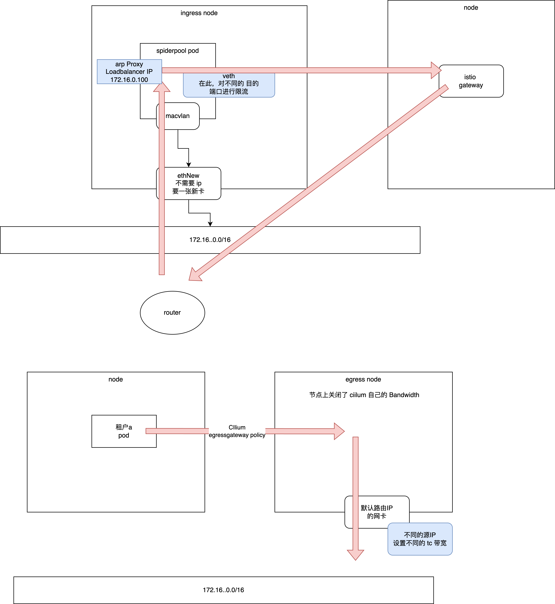

# 集群带宽限制



## ingress

1. 选一个节点作为 ingressNode ，实现入口流量限流。
    
    - 它上没没有运行 istio-gateway ( 发现如果部署在同节点，流量不通)，它需要一张额外的物理网卡来引导入口流量（这张网卡将不会运行 cilium 的 kubeproxy replacement ，否则 它的 nodeport ebpf 解析会体现生效）

    - 对选择的这个 ingressNode，实现入口流量限流。 节点，配置 如下 cilium 配置，去除掉 用于引到 入口流量的 网卡 

```bash
cat <<EOF | kubectl apply -f -
apiVersion: cilium.io/v2
kind: CiliumNodeConfig
metadata:
  namespace: kube-system
  name: disable-nodeport
spec:
  nodeSelector:
    matchLabels:
      # 设置为入口流量节点的 label
      kubernetes.io/hostname: "ingressNode"
  defaults:
    # 如下设置的网卡,包含了节点上 kubelet 工作的物理网，务必不能包含用于后续 macvlan pod 的 master 接口
    devices: "eth1,eth2,....（不能有 用于引导流量的 macvlan 父网卡）"
EOF
```

2. 对选择作为 ingressNode 的节点上，执行以下所有命令，避免后续 引流 pod 的流量 转发到主机后，被主机过滤了

```bash

echo 0 > /proc/sys/net/ipv4/conf/all/rp_filter
echo 0 > /proc/sys/net/ipv4/conf/default/rp_filter
for interface in /proc/sys/net/ipv4/conf/*/rp_filter; do
    echo 0 > "$interface"
done

# 创建或更新 sysctl 配置
SYSCTL_FILE="/etc/sysctl.d/99-rp-filter.conf"
cat > "$SYSCTL_FILE" << 'EOF'
net.ipv4.conf.all.rp_filter = 0
net.ipv4.conf.default.rp_filter = 0
EOF
sysctl -p "$SYSCTL_FILE"
```

3. 在 cilium 上设置 Loadbalancer ip 池，但是，不要使用 arp 或者 bgp crd 来发布它 ！

```bash
# ip 地址池 应该是 入口流量网卡的 子网，其中的ip 没人使用 
cat <<EOF | kubectl apply -f -
apiVersion: "cilium.io/v2alpha1"
kind: CiliumLoadBalancerIPPool
metadata:
  name: 13-ipv4
spec:
  blocks:
  - start: "172.16.13.90"
    stop: "172.16.13.99"
EOF
```

4. 在入口流量节点 ingressNode 上启动一个 spiderpool 的 macvlan pod （ 纯 macvlan 单网卡，不需要和 cilium 搭配 双 网卡；且 该 pod yaml 需要设置  privileged=true ），并且 该 pod ip 不能是 Loadbalancer ip 池中的 ip
    在 macvlan pod 内部 运行如下脚本 ingress.sh 


```shell
# 注意，macvlan pod 中的网卡 不能生效 Loadbalancer ip 地址
# ingress-ip 是 istio gateway 的 Loadbalancer ip
# via-ip 是 宿主机的 kubelet ip
# via-mac 是本pod 在宿主机侧的 veth 网卡的 mac , 可选，在 spiderpool 场景下，会尝试自动检测
# total-bandwidth 设置集群总的入口带宽 ， 单位是 Mbit 或者 Gbit
# tc-rule 设置一个 istio gateway 的 Loadbalancer ip 入口 端口的限流规则，格式 "port[,port]...:bandwidth"

 ./ingress.sh  \
 	--ingress-ip "172.16.13.90"  \
 	--ingress-interface "eth0" \
 	--egress-interface "veth0" \
 	--via-ip "172.16.13.11" \
 	--total-bandwidth "300Mbit" \
 	--tc-rule "80:10Mbit"  \
 	--tc-rule "443,900:20Mbit"

# 查看生效规则
 ./ingress.sh show
```


## 集群 egress 带宽限制

总体思路：每个租户的所有 pod ，都在 出口网关上 分配一个独立的 出口IP，基于每一个出口 ip 来做流控

1. 针对 cilium 出口网关 节点上，配置如下对象，重启节点的 cilium agent，让其关闭 Bandwidth ，这样才能避免 cilium 设置 tc 规则 
    配置完成后，冲洗 对应的 出口网关节点


``` bash
~# tc qdis show dev eth1
    qdisc fq 833a: root refcnt 2 limit 10000p flow_limit 100p buckets 32768 orphan_mask 1023 quantum 3028b initial_quantum 15140b low_rate_threshold 550Kbit refill_delay 40ms timer_slack 10us horizon 2s horizon_cap
```

```shell
cat <<EOF | kubectl apply -f -
apiVersion: cilium.io/v2
kind: CiliumNodeConfig
metadata:
  namespace: kube-system
  name: disable-bandwidth
spec:
  nodeSelector:
    matchLabels:
      kubernetes.io/hostname: "worker4"
  defaults:
    enable-bandwidth-manager: "false"
EOF

```

2. 为不同租户的 pod 创建 出口网关策略

让它们出集群的流量都走出口网关节点的 ，每个租户 独立使用 一个  egressIP 源 ip  ， 且该 源 ip 是 出口网关节点的上默认路由网卡 的 同子网 ip （不能被人占用），注意：根据官方的要求，出口网关节点上，需要手动把每个租户的  出口IP 设置到 默认路由网卡
     例：ip addr add 172.16.1.49/32 dev eth1


为某个租户 的所有 pod 配置策略如下，分配一个 独立的 egressIP 源 ip

```bash
TENATN_NAME="default"
EgressIP="172.16.1.49"
cat <<EOF | kubectl apply -f -
apiVersion: cilium.io/v2
kind: CiliumEgressGatewayPolicy
metadata:
  name: tenant-${TENATN_NAME}
spec:
  selectors:
  - podSelector:
      matchLabels:
        # 如下 label 命中整个租户下的 pod 
        io.kubernetes.pod.namespace: ${TENATN_NAME}
  destinationCIDRs:
    - "0.0.0.0/0"
  egressGateway:
    nodeSelector:
      matchLabels:
        # 设置出口网关节点的 label
        kubernetes.io/hostname: worker4
    # 该 ip 必须是 出口网关节点的 默认路由网卡 的 同子网 ip （该ip未被使用）
    egressIP: ${EgressIP}
EOF

#查看节点上 agent 的生效情况
kubectl -n kube-system exec ds/cilium -- cilium-dbg bpf egress list

```


3. 在出口网关节点上，运行如下脚本 egress.sh ，实现配置 网卡上的 带宽限制 


```shell
# egress-interface 是出口网卡，它应该是默认路由的网卡
# egress-total-bandwidth 控制的是总的出口带宽
# egress-ip-bandwidth 设置了 每个租户的 出口 ip 的出口带宽 。 每个ip可以对应到一个或者多个租户来使用，每个ip后边带着针对该 ip 的出口带宽限制
 ./egress.sh \
     --egress-interface eth1 \
     --egress-total-bandwidth "1Gbit" \
     --egress-ip-bandwidth "172.16.1.49:200Mbit" \
     --egress-ip-bandwidth "172.16.1.50,172.16.1.51:300Mbit"
```

## 未来todo

搞一个 crd 实例，实现租户的带宽配置, 相应的 controller 生效配置到 macvlan pod、CiliumEgressGatewayPolicy 和 egressGateway node

```yaml
spec:
    # 用于拿取 Loadbalancer IP
    ingressServiceName: istio-gateway
    ingressServiceNs: istio-system
    ingressTotalBandwidth: 10Gbit
    egressTotalBandwidth: 10Gbit
    egressNode: worker10
    egressInterface: eth1
    tenant:
      - name: tenant1
        ingressPort: 4000
        ingressBandwidth: 300Mbit
        egressIP: 172.16.1.49
        egressBandwidth: 200Mbit
```

